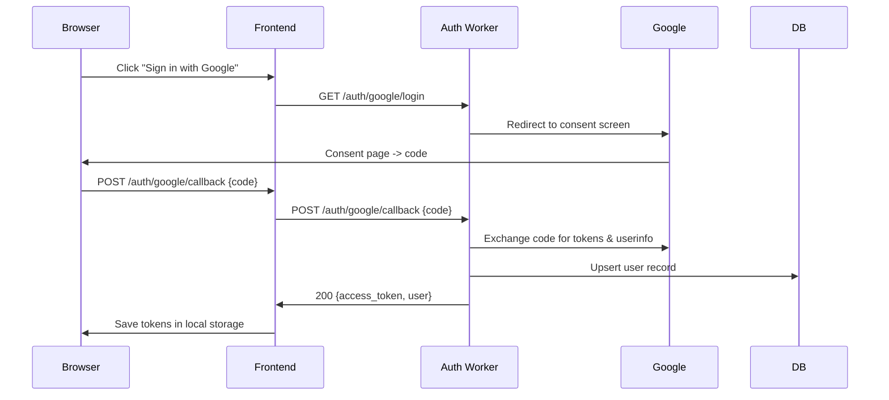

# Zenos Backend

This repository contains the Cloudflare Workers–based backend for the Zenos
platform.  It provides authentication services and a thin API layer that
stores users in a SQLite database and issues JSON Web Tokens (JWTs).

## Overview

The service is written in Python and runs on Cloudflare's Workers runtime via
`wrangler`.  It uses:

* `js` bindings for request/response objects
* an in-process SQLite database for user persistence (`env.DB`)
* a KV namespace (`env.SESSIONS`) for storing refresh tokens
* Google OAuth2 for login
* JWTs for stateless access control

At present only authentication endpoints are implemented; additional
business logic can be mounted in `src/*` with the same pattern.

## Getting Started

1. Install the [uv toolchain](https://docs.astral.sh/uv/getting-started/installation/).
2. Create and activate the virtual environment:
   ```sh
   uv venv
   uv sync
   ```
3. Configure your editor to use the `.venv` folder for Python.
4. Set up a `wrangler.toml` file with the following bindings:
   ```toml
   [env.dev]
   vars = {
     GOOGLE_CLIENT_ID = "...",
     JWT_SECRET = "...",
     FRONTEND_URL = "http://localhost:3000"
   }

   [[kv_namespaces]]
   binding = "SESSIONS"
   id = "..."
   ```
5. Start the development server:
   ```sh
   wrangler dev
   ```

   The worker will listen for HTTP requests, which you can exercise with curl
   or via the frontend.

## Authentication Flow

Users sign in using Google OAuth2.  The flow is illustrated in the
sequence diagram below:



```mermaid
usecaseDiagram
    actor Browser
    actor Frontend
    actor "Auth Worker" as Worker

    Browser --> Frontend : "Login with Google"
    Frontend --> Worker : "POST /auth/google/callback"
    Frontend --> Worker : "POST /auth/refresh"
    Frontend --> Worker : "POST /auth/logout"
```

The backend exposes the following endpoints:

| Path                         | Method | Description |
|------------------------------|--------|-------------|
| `/auth/google/login`         | GET    | Redirect to Google OAuth consent screen |
| `/auth/google/callback`      | POST   | Accept authorization code and return JWTs; body `{code}` |
| `/auth/refresh`              | POST   | Accept refresh token and issue new access token |
| `/auth/logout`               | POST   | Revoke a refresh token |

### Request / Response Examples

#### Callback

```json
POST /auth/google/callback
{
  "code": "4/0Ab...
}
```

```json
200 OK
{
  "access_token": "eyJ...",
  "user": {"id": "...", "email": "...", "role": "READER"}
}
```

#### Refresh

```json
POST /auth/refresh
{
  "refresh_token": "eyJ..."
}
```

```json
200 OK
{
  "access_token": "eyJ..."
}
```

## Sequence and Use-Case Diagrams

See the Mermaid code above for a login sequence.  Additional diagrams can be
added under `docs/` or inline as needed.

## Development Notes

* This project is intentionally small; for larger applications you may want to
  introduce a proper routing library and separate controllers.
* All database interactions are asynchronous and use simple SQL strings;
  consider using an ORM if complexity grows.

---

Feel free to update this document as the backend evolves.
