# zenos.work — Use Cases & System Flow Reference

All flows follow the 4-layer architecture:
`Handler → Service → Repository → D1/R2`

Each sequence diagram shows the exact class path from user action to response.

---

## Table of Contents

1. [Authentication](#1-authentication)
   - 1.1 Google Login
   - 1.2 Token Refresh
   - 1.3 Logout
2. [User Management](#2-user-management)
   - 2.1 View Own Profile
   - 2.2 Update Profile
   - 2.3 Upgrade to Author
   - 2.4 Update Topic Preferences
3. [Article Lifecycle](#3-article-lifecycle)
   - 3.1 Create Draft
   - 3.2 Submit for Approval
   - 3.3 Approve Article
   - 3.4 Reject Article
   - 3.5 Publish Article
   - 3.6 Edit Article
   - 3.7 Archive Article
   - 3.8 Delete Article
4. [Feed & Discovery](#4-feed--discovery)
   - 4.1 Home Feed (Personalised)
   - 4.2 Read Article
   - 4.3 Featured Carousel
   - 4.4 Following Feed
   - 4.5 Search Articles
   - 4.6 Browse by Tag
5. [Comments](#5-comments)
   - 5.1 Post Comment
   - 5.2 Reply to Comment
   - 5.3 Edit Comment
   - 5.4 Delete Comment
6. [Social Actions](#6-social-actions)
   - 6.1 Like Article
   - 6.2 Bookmark Article
   - 6.3 Follow Author
7. [Media](#7-media)
   - 7.1 Upload Cover Image
8. [Admin & Governance](#8-admin--governance)
   - 8.1 View Platform Stats
   - 8.2 View Approval Queue
   - 8.3 Ban User
   - 8.4 Assign Role
9. [MVP Coverage](#9-mvp-coverage)
    - 9.1 MVP1: Publishable Knowledge Platform
    - 9.2 MVP2: Trust, Compliance, and Moderation
    - 9.3 MVP3: Discovery and Growth Loops
10. [Frontend Use Cases](#10-frontend-use-cases)
    - 10.1 Frontend Use-Case Diagram
    - 10.2 Frontend Sequence: Create and Publish Flow

---

## 1. Authentication

### 1.1 Google Login

**Actor:** Any visitor
**Precondition:** None
**Result:** JWT access token + refresh token, user record upserted in D1

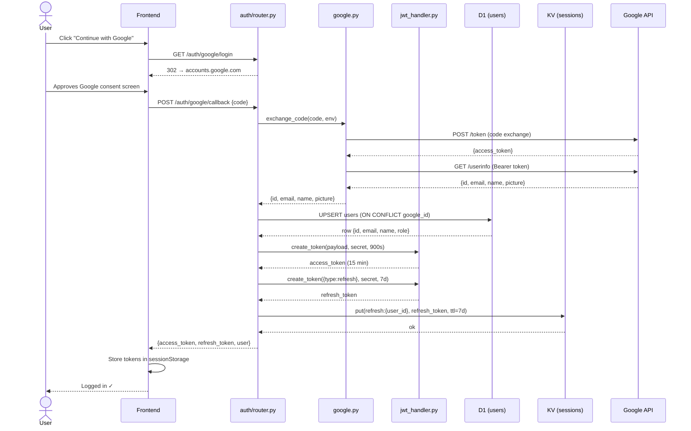

### 1.2 Token Refresh

**Actor:** Authenticated user (token expired)
**Result:** New access token issued without re-login

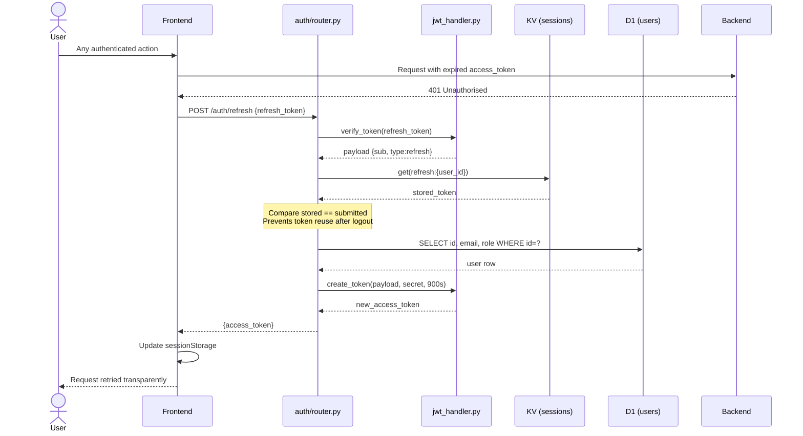

### 1.3 Logout

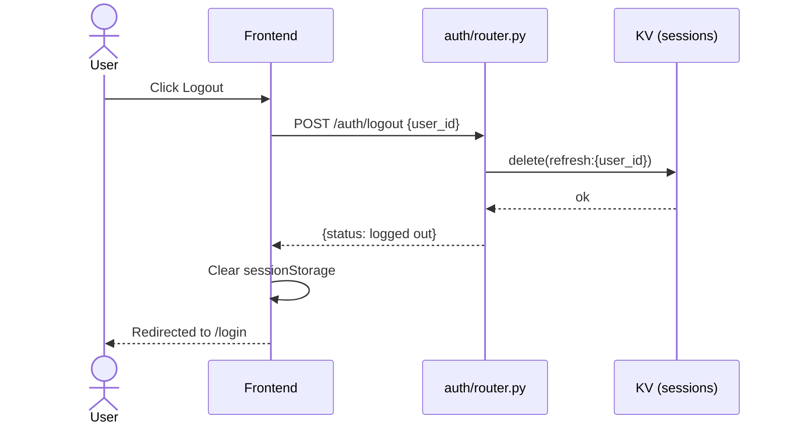

---

## 2. User Management

### 2.1 View Own Profile

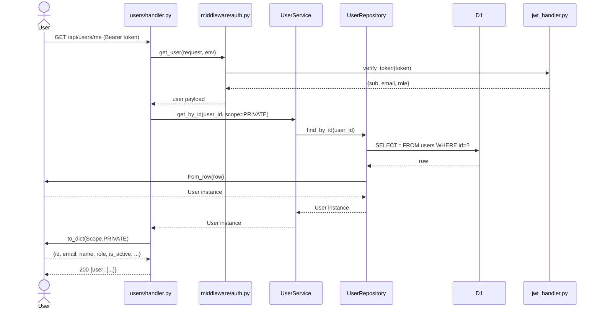

### 2.2 Update Profile

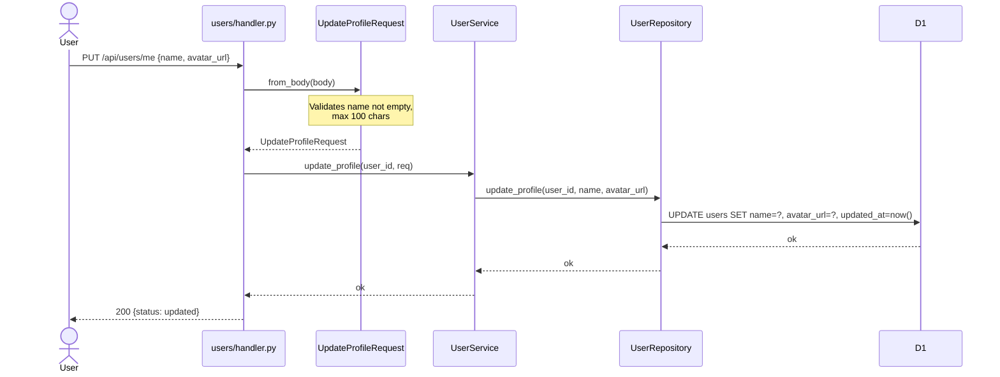

### 2.3 Upgrade to Author

**Actor:** READER role user who wants to publish content
**Business rule:** Self-upgrade only allowed READER → AUTHOR. Any other role change requires SUPERADMIN.

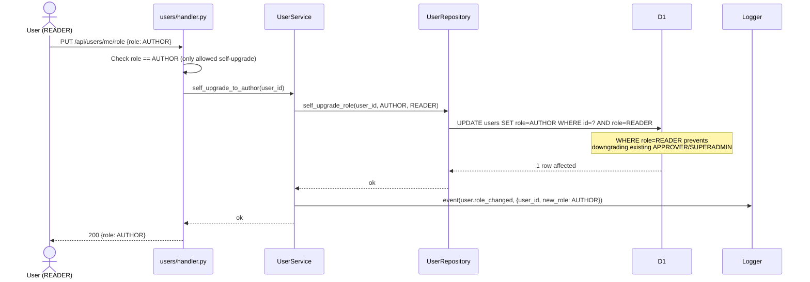

### 2.4 Update Topic Preferences

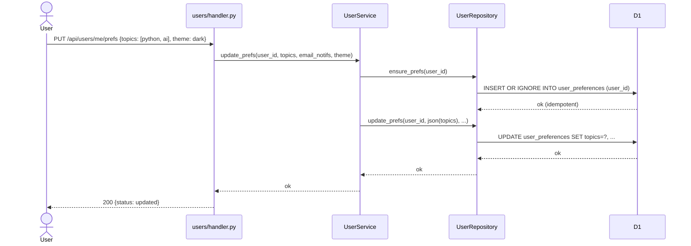

---

## 3. Article Lifecycle

### 3.1 Create Draft

**Actor:** AUTHOR, APPROVER, or SUPERADMIN
**Result:** Article created with status=DRAFT

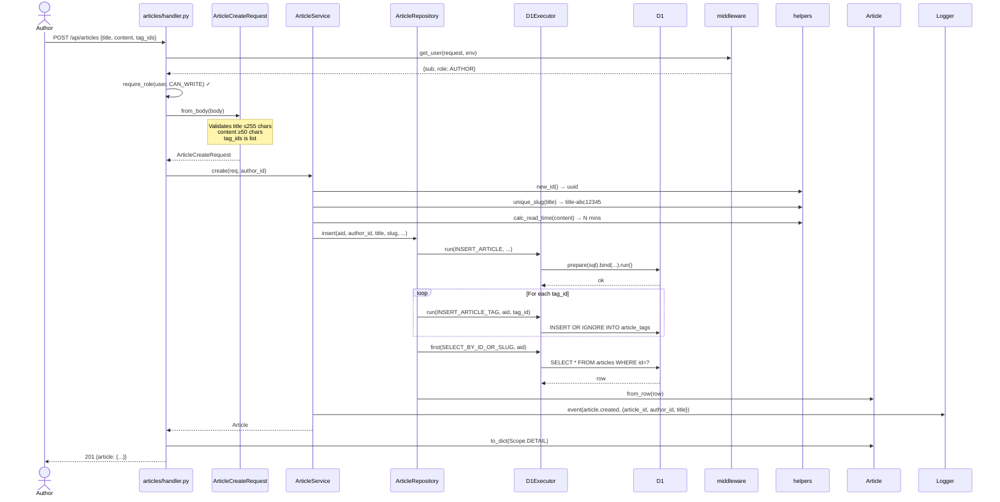

### 3.2 Submit for Approval

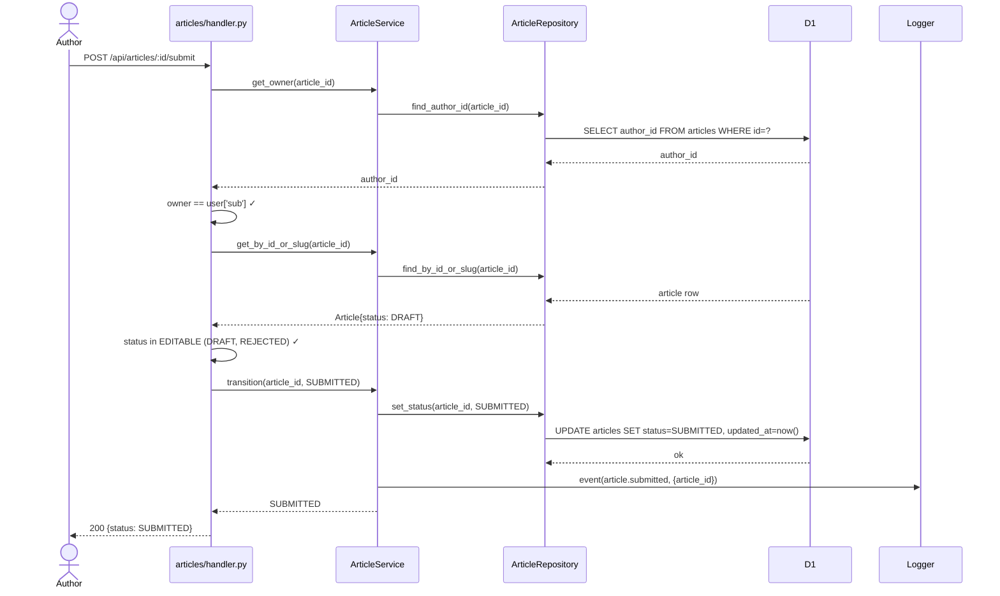

### 3.3 Approve Article

**Actor:** APPROVER or SUPERADMIN

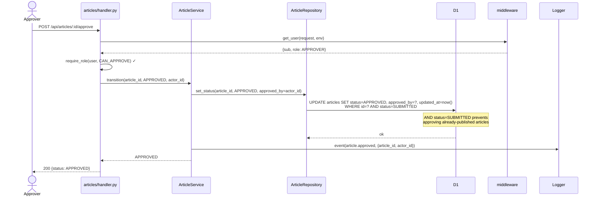

### 3.4 Reject Article

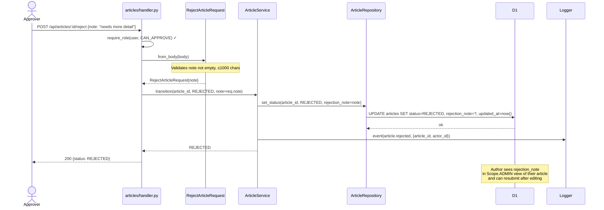

### 3.5 Publish Article

**Precondition:** Article must be in APPROVED state

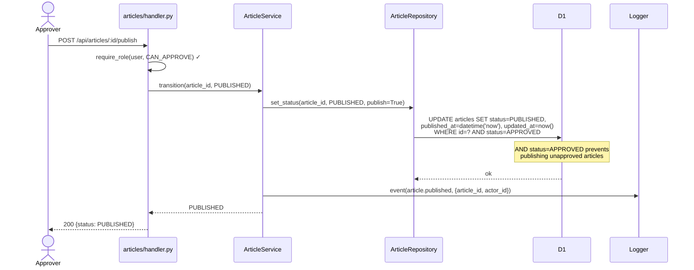

### 3.6 Edit Article

**Precondition:** Article must be DRAFT or REJECTED
**Actor:** Article's own author, or SUPERADMIN

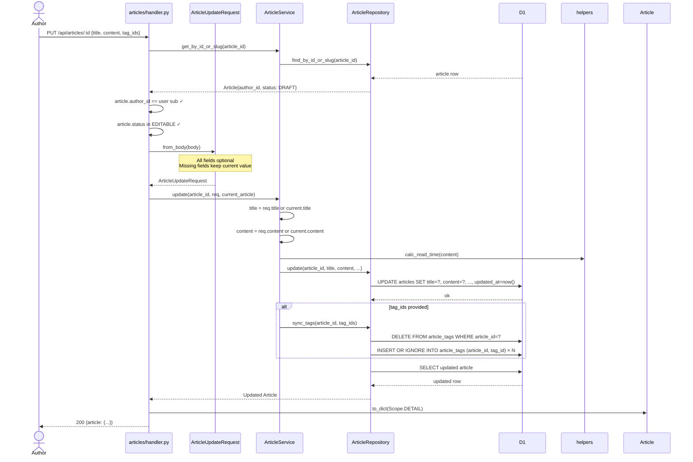

---

## 4. Feed & Discovery

### 4.1 Home Feed (Personalised)

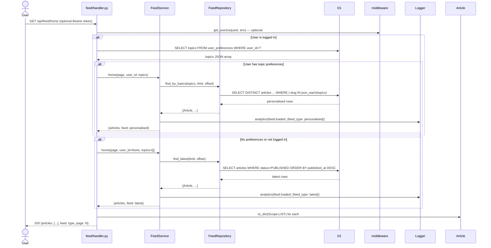

### 4.2 Read Article

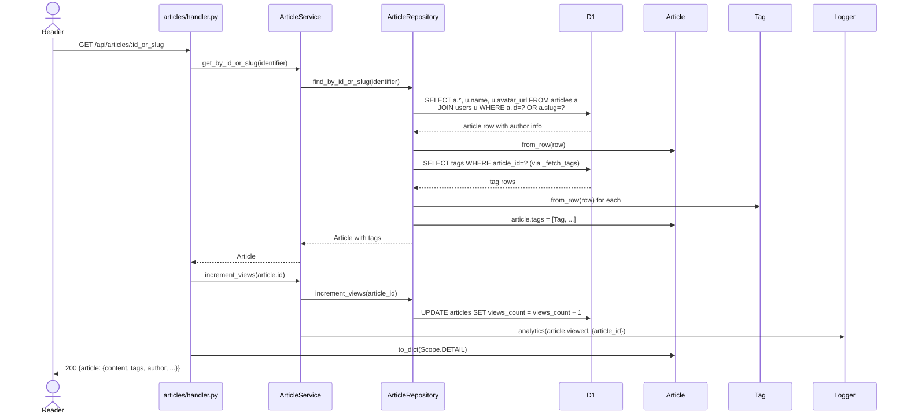

---

## 5. Comments

### 5.1 Post Comment

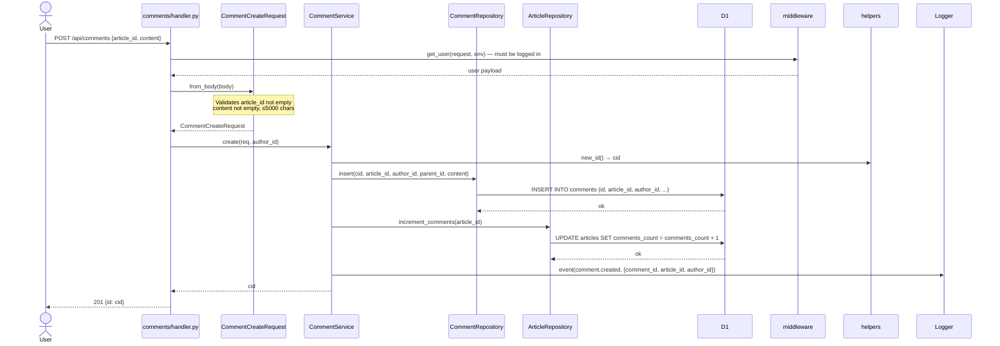

### 5.2 Reply to Comment

Same as 5.1 but with `parent_id` set. The `CommentCreateRequest` accepts `parent_id` and passes it through. Top-level comments have `parent_id = NULL`.

### 5.3 Edit Comment

**Actor:** Comment's own author
**Business rule:** Author can edit own comments. Content must still be non-empty and ≤5000 chars.

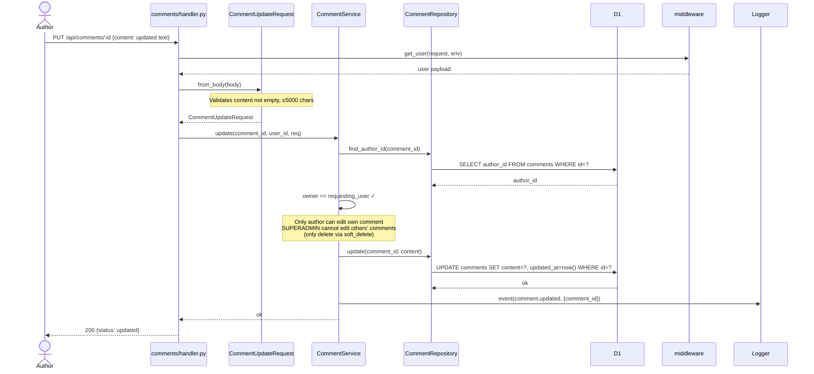

### 5.4 Delete Comment (Soft)

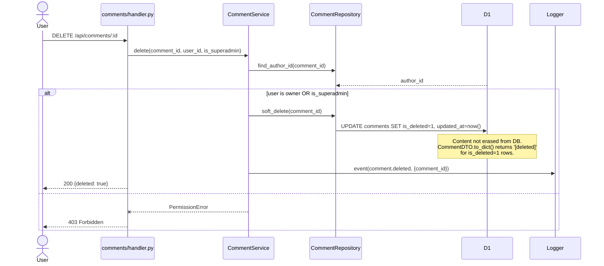

---

## 6. Social Actions

### 6.1 Like Article

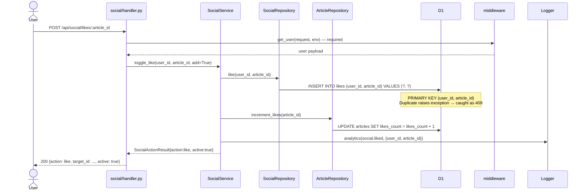

### 6.3 Follow Author

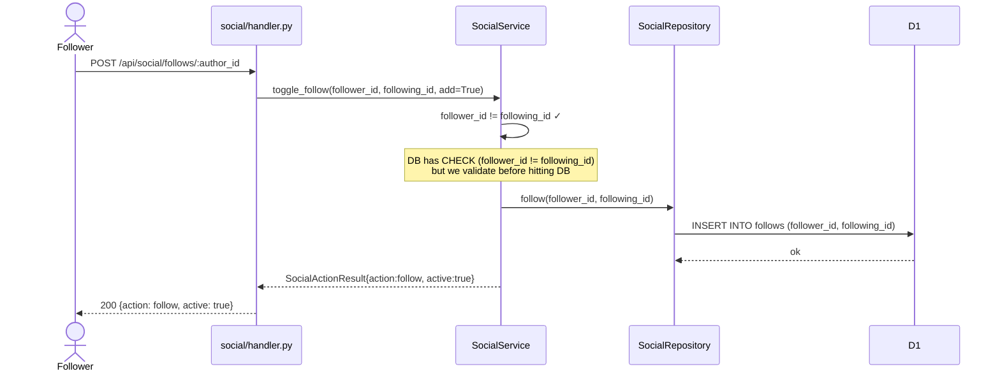

---

## 7. Media

### 7.1 Upload Cover Image

```mermaid
sequenceDiagram
    actor Author
    participant handler.py as media/handler.py
    participant service.py as MediaService
    participant repo.py as MediaRepository
    participant R2 as R2 (env.MEDIA)

    Author->>handler.py: POST /api/media/upload (Content-Type: image/jpeg, body: binary)
    handler.py->>middleware: get_user(request, env)
    middleware-->>handler.py: user payload

    handler.py->>service.py: upload(user_id, request)
    service.py->>request: headers.get(Content-Type)
    service.py->>request: arrayBuffer()
    service.py->>service.py: size = body.byteLength

    service.py->>repo.py: upload(user_id, content_type, body, size)
    repo.py->>repo.py: Validate content_type in ALLOWED_TYPES
    repo.py->>repo.py: Validate size ≤ 5MB
    repo.py->>helpers: new_id() → uuid
    repo.py->>repo.py: key = uploads/{user_id}/{uuid}.jpg

    repo.py->>R2: put(key, body, {contentType})
    R2-->>repo.py: ok

    repo.py-->>service.py: key
    service.py->>service.py: url = https://media.zenos.work/{key}
    service.py->>Logger: event(media.uploaded, {user_id, key, size_bytes})
    service.py-->>handler.py: {url, key}
    handler.py-->>Author: 201 {url: https://media.zenos.work/..., key: ...}

    Note over Author: Author uses url as cover_image_url<br/>in ArticleCreateRequest
```

---

## 8. Admin & Governance

### 8.1 View Platform Stats

**Actor:** SUPERADMIN only

```mermaid
sequenceDiagram
    actor Admin as Admin (SUPERADMIN)
    participant handler.py as admin/handler.py
    participant service.py as AdminService
    participant repo.py as AdminRepository
    participant D1

    Admin->>handler.py: GET /api/admin/stats
    handler.py->>middleware: get_user(request, env)
    handler.py->>handler.py: require_role(user, [SUPERADMIN]) ✓

    handler.py->>service.py: get_stats()

    par Parallel DB queries
        service.py->>repo.py: count_active_users()
        repo.py->>D1: SELECT COUNT(*) FROM users WHERE is_active=1
    and
        service.py->>repo.py: count_active_comments()
        repo.py->>D1: SELECT COUNT(*) FROM comments WHERE is_deleted=0
    and
        service.py->>repo.py: count_articles_by_status()
        repo.py->>D1: SELECT status, COUNT(*) FROM articles GROUP BY status
    and
        service.py->>repo.py: find_top_articles()
        repo.py->>D1: SELECT id, title, views_count, likes_count ... LIMIT 10
    end

    service.py-->>handler.py: {total_users, total_comments, articles_by_status, top_articles}
    handler.py-->>Admin: 200 {stats: {...}}
```

### 8.2 View Approval Queue

**Actor:** APPROVER or SUPERADMIN

```mermaid
sequenceDiagram
    actor Approver
    participant handler.py as admin/handler.py
    participant service.py as AdminService
    participant repo.py as AdminRepository
    participant D1

    Approver->>handler.py: GET /api/admin/queue
    handler.py->>handler.py: require_role(user, CAN_APPROVE) ✓

    handler.py->>service.py: get_approval_queue()
    service.py->>repo.py: find_approval_queue()
    repo.py->>D1: SELECT a.*, u.name AS author_name FROM articles a<br/>JOIN users u WHERE a.status=SUBMITTED ORDER BY updated_at ASC
    D1-->>repo.py: submitted article rows
    repo.py->>Article: from_row(row) for each
    repo.py-->>service.py: [Article, ...]

    service.py->>Article: to_dict(Scope.ADMIN) for each
    Note over service.py: ADMIN scope includes rejection_note,<br/>approved_by for full context
    service.py-->>handler.py: [{article in ADMIN scope}, ...]
    handler.py-->>Approver: 200 {queue: [...]}
```

---

## 9. MVP Coverage

This section maps shipped and planned flows to product milestones, so PM, engineering, and QA can verify that each MVP is functionally represented in API and UI paths.

### 9.1 MVP1: Publishable Knowledge Platform

MVP1 focus: authenticated writing, review workflow, publishing, and readable discovery surfaces.

- Authentication and session lifecycle: sections 1.1 to 1.3
- User onboarding and author enablement: section 2.3
- Draft to publish lifecycle: sections 3.1 to 3.6
- Reader discovery and consumption: sections 4.1 and 4.2
- SR-010 delivered via reader-side heading-derived table of contents
- SR-011 delivered via reader-side success signals:
  - Verification freshness state (`freshly verified`, `aging`, `expired`, or `not set`)
  - Engagement traction signal derived from views, likes, and comments
  - Outcome evidence signal from outcome-tag coverage
- Rich article metadata currently used by frontend:
    - Dynamic content types via `GET /api/articles/content-types`
    - In-page table-of-contents rendering from article headings

### 9.2 MVP2: Trust, Compliance, and Moderation

MVP2 focus: governance controls, safer community features, and editorial reliability.

- Approval operations and queue management: sections 3.3, 3.4, and 8.2
- Comment moderation support and soft deletion: section 5.4
- Role-aware governance functions: section 8.1
- Policy and lifecycle support in data model:
    - Terms acceptance tracking on users
    - Article moderation and verification metadata
    - Notification types for moderation outcomes

### 9.3 MVP3: Discovery and Growth Loops

MVP3 focus: sustained engagement through personalisation, social loops, and operational signals.

- Personalised home feed with preference-aware fallback: section 4.1
- Social actions (likes, follows, bookmarks): section 6
- Notification-driven feedback loops: notifications table and social/comment events
- Platform analytics and top-content visibility: section 8.1
- Superadmin extensibility for content taxonomy:
    - Runtime content-type management through admin API
    - Non-breaking frontend filter/write integration for newly added types

---

## 10. Frontend Use Cases

### 10.1 Frontend Use-Case Diagram

```mermaid
flowchart LR
        reader[Reader]
        author[Author]
        approver[Approver]
        superadmin[Superadmin]

        subgraph frontend[Frontend Web App]
                auth[Authenticate with Google]
                feed[View personalised home feed]
                read[Read article with TOC]
                write[Create or edit draft]
                submit[Submit draft for approval]
                moderate[Approve or reject article]
                search[Search and filter by content type]
                manageTypes[Manage content types]
        end

        reader --> auth
        reader --> feed
        reader --> read
        reader --> search

        author --> write
        author --> submit
        author --> search
        author --> read

        approver --> moderate
        approver --> read

        superadmin --> manageTypes
        superadmin --> moderate
        superadmin --> search
```

### 10.2 Frontend Sequence: Create and Publish Flow

```mermaid
sequenceDiagram
        actor Author
        participant Browser as Browser UI
        participant WritePage as WritePage.tsx
        participant API as api.ts
        participant ArticleAPI as /api/articles
        participant AdminAPI as /api/admin/content-types

        Author->>Browser: Open Write page
        Browser->>WritePage: Mount component
        WritePage->>API: getArticleContentTypes()
        API->>ArticleAPI: GET /api/articles/content-types
        ArticleAPI-->>API: [article, how-to, case-study, ...]
        API-->>WritePage: contentTypeOptions
        WritePage-->>Author: Render dynamic content-type selector

        alt Superadmin adds a new type
                Author->>WritePage: Enter slug/name and click Add
                WritePage->>API: createContentType(slug, name, description)
                API->>AdminAPI: POST /api/admin/content-types
                AdminAPI-->>API: 201 {content_type}
                API-->>WritePage: new content type
                WritePage->>API: getArticleContentTypes()
                API->>ArticleAPI: GET /api/articles/content-types
                ArticleAPI-->>WritePage: refreshed list
        end

        Author->>WritePage: Fill title, content, tags, content_type
        WritePage->>API: createArticle(payload)
        API->>ArticleAPI: POST /api/articles
        ArticleAPI-->>API: 201 {article: DRAFT}
        API-->>WritePage: created article

        Author->>WritePage: Submit for approval
        WritePage->>API: submitArticle(articleId)
        API->>ArticleAPI: POST /api/articles/:id/submit
        ArticleAPI-->>WritePage: 200 {status: SUBMITTED}
        WritePage-->>Author: Show success and transition state
```

---

## Class Responsibility Summary

```
┌─────────────────────────────────────────────────────────────────────────────┐
│ Layer          │ Class               │ Responsibility                        │
├────────────────┼─────────────────────┼───────────────────────────────────────┤
│ HTTP           │ handler.py          │ Route, auth check, call service       │
│                │ middleware/auth.py  │ JWT verify, role check                │
│                │ middleware/logging  │ Request/response logging, trace_id    │
├────────────────┼─────────────────────┼───────────────────────────────────────┤
│ Business       │ service.py          │ Business rules, event logging, no SQL │
│ Logic          │ interface.py        │ Protocol contract for the service     │
├────────────────┼─────────────────────┼───────────────────────────────────────┤
│ Data Access    │ repository.py       │ Execute SQL, map rows to models       │
│                │ queries.py          │ SQL constants only                    │
│                │ db/executor.py      │ D1 binding wrapper (prep/bind/run)    │
│                │ db/repository.py    │ BaseRepository + IRepository Protocol │
├────────────────┼─────────────────────┼───────────────────────────────────────┤
│ Domain Models  │ models/*/model.py   │ Dataclass + scope-aware to_dict()     │
│                │ models/*/requests.py│ Input validation via from_body()      │
│                │ models/common/enums │ String constants (UserRole, Status)   │
│                │ models/common/page  │ PaginatedResponse wrapper             │
├────────────────┼─────────────────────┼───────────────────────────────────────┤
│ Logging        │ utils/logger.py     │ Structured JSON logs, all event types │
│                │ utils/loki.py       │ Loki/Grafana forwarder                │
│                │ utils/elk.py        │ Elasticsearch forwarder               │
│                │ utils/forwarder.py  │ Factory: ELK > Loki > stdout          │
│                │ utils/context.py    │ RequestContext: trace_id + Logger     │
└────────────────┴─────────────────────┴───────────────────────────────────────┘
```

---

## Status Transition Rules

```
DRAFT ──────────────→ SUBMITTED  (author submits)
REJECTED ───────────→ SUBMITTED  (author resubmits after edits)
SUBMITTED ──────────→ APPROVED   (approver approves)
SUBMITTED ──────────→ REJECTED   (approver rejects + note required)
APPROVED ───────────→ PUBLISHED  (approver publishes)
PUBLISHED ──────────→ ARCHIVED   (author or approver archives)
ARCHIVED ─── (terminal, no further transitions defined)

Editable states: DRAFT, REJECTED
```
